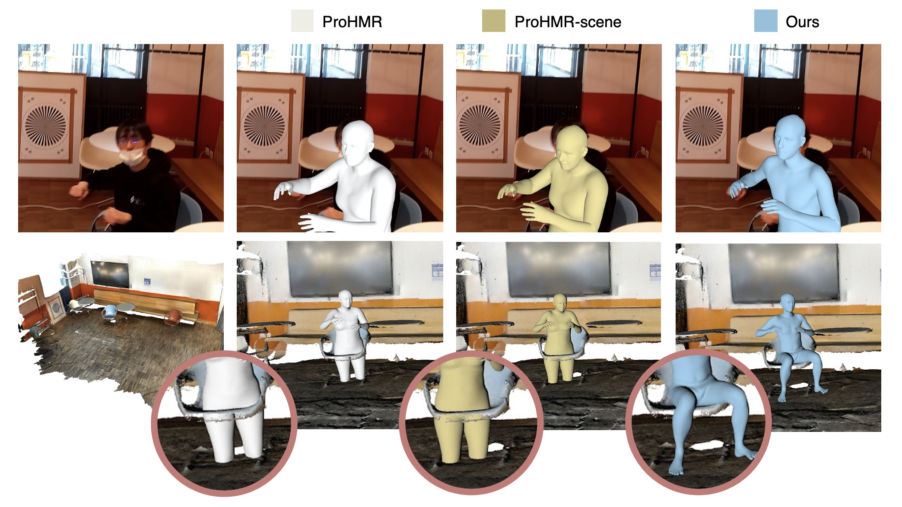

# EgoHMR
Official PyTorch code for EgoHMR: Probabilistic Human Mesh Recovery in 3D Scenes from Egocentric Views (2023 ICCV Oral)

[[Project page]](https://sanweiliti.github.io/egohmr/egohmr.html) 
[[Video]](https://www.youtube.com/watch?v=K6m0BmfMG-E) 
[[Paper]](https://arxiv.org/pdf/2304.06024.pdf)




## Installation
Creating a clean conda environment and install all dependencies by:
```
conda env create -f environment.yml
```
After the installation is complete, activate the conda environment by:
```
conda activate egohmr
```

## Data preparation
**Download EgoBody dataset and preprocessed data:** 
please follow the instructions and download the EgoBody dataset at [https://egobody.inf.ethz.ch](https://egobody.inf.ethz.ch). 
Also download the preprocessed scene point clouds (`Egohmr_scene_preprocess_xxx`) and EgoBody egocentric data in npz format (`annotation_egocentric_smpl_npz`) with the same link. 
For this repo, you only need to download and unzip the following files:
```
EgoBody
├── data_info_release.csv
├── kinect_cam_params
├── calibrations
├── egocentric_color
├── scene_mesh
├── Egohmr_scene_preprocess_s1_release
├── Egohmr_scene_preprocess_cube_s2_from_gt_release
├── Egohmr_scene_preprocess_cube_s2_from_pred_release
├── annotation_egocentric_smpl_npz
```

**Download trained checkpoints and other data:**
- trained [EgoHMR checkpoints](https://drive.google.com/file/d/1cohQFH5SG39ZTTP1Zkr3HGrpX4xKggmF/view?usp=sharing)
- follow [this script](https://github.com/nkolot/ProHMR/blob/master/fetch_data.sh) to download relevant data from ProHMR repo
- SMPL body models ([neutral](https://smplify.is.tue.mpg.de/) / [male and female](https://smpl.is.tue.mpg.de/))
- [test results](https://drive.google.com/file/d/1tw_I8OcPWxaJ07mgDQOOn3LmUIrHec15/view?usp=sharing) generated by EgoHMR on EgoBody test set

After downloading, please organize them as the following folder structure :
```
EgoHMR
├── checkpoints
│   ├── checkpoints_egohmr
│   │   ├── 53618
│   │   ├── 91453
│   ├── checkpoints_prohmr
│   │   ├── checkpoints.pt
├── data
│   ├── datasets
│   │   ├── cmu_mocap.npz
│   ├── smpl
│   │   ├── smpl_mean_params.npz
│   │   ├── smpl
│   │   │   ├── SMPL_FEMALE.pkl
│   │   │   ├── SMPL_MALE.pkl
│   │   │   ├── SMPL_NEUTRAL.pkl
├── output_results_release
```
- `checkpoints/checkpoints_prohmr/checkpoints.pt`: pretrained checkpoint downloaded from [ProHMR](https://github.com/nkolot/ProHMR/) for training initialization.
- `checkpoints/checkpoints_egohmr/53618/best_model.pt`: trained checkpoint for stage 1.
- `checkpoints/checkpoints_egohmr/91453/best_model_mpjpe_vis.pt`: trained checkpoint for stage 2.


## Stage 1 (ProHMR-scene)
Stage 1 is the ProHMR-scene baseline that aims to predict the body translations. 
This model combines scene features with ProHMR to predict relatively accurate global translation, 
but the local body pose still suffers from inplausible human-scene inter-penetrations.

**Preprocessing:** crop scene vertices in front of the egocentric camera
```
python preprocess_scene_s1.py --split=train/val/test --data_root=PATH/TO/DATASET  --save_root=PATH/TO/SAVE/RESULTS 
```
If you want to skip the preprocessing,
you can find the preprocessed results in downloaded `Egohmr_scene_preprocess_s1_release` folder.

**Train:** train proHMR-scene on EgoBody dataset
```
python train_prohmr_scene.py --dataset_root=PATH/TO/DATASET  --save_dir=PATH/TO/SAVE/MODELS/LOGS 
```
**Test:** test proHMR-scene on EgoBody dataset, and (optional) save the predicted body translation for stage 2. 
It also outputs the full-body MPJPE/V2V evaluation results (for reference and debugging). 
```
python test_prohmr_scene.py --dataset_root=PATH/TO/DATASET  --save_pred_transl=PATH/TO/SAVE/PRED/TRANSL
```
Available configs:
* `num_samples`: number of samples to draw for each input image
* `render`: if set to `True`, render predicted smpl body mesh on image / in 3D scene, and save to `output_render_root`
* `render_multi_sample`: if set to `True`, for each image, render all sampled bodies, else only render the mode sample (for `z=0`) 
* `vis_o3d`: if set to `True`, visualize the predicted 3D body mesh in the 3D scene with `open3d`
* `vis_o3d_gt`: if set to `True`, visualize the ground truth body together
* `save_pred_transl`: if set to `True`, save predicted body translation to `save_root`

You can find the predicted body translation results in `output_results_release/output_prohmr_scene_53618`.

## Stage 2 (EgoHMR pose diffusion)
**Preprocessing-train:**
crop scene vertices in a 2x2 cube around the ground truth body translation for training usage:
```
python preprocess_scene_s2_for_train.py --split=train/val --data_root=PATH/TO/DATASET  --save_root=PATH/TO/SAVE/RESULTS 
```
If you want to skip the preprocessing, 
you can find the preprocessed results in downloaded `Egohmr_scene_preprocess_cube_s2_from_gt_release` folder.

**Train:** train our EgoHMR model on EgoBody dataset
```
python train_egohmr.py --dataset_root=PATH/TO/DATASET  --save_dir=PATH/TO/SAVE/MODELS/LOGS 
```
Available configs:
* `timestep_respacing_eval`: chose from `ddim5/ddpm`, using ddim sampling for validation during training can accelerate training
* `start_coap_epoch`: from which epoch to start adding scene collision loss
* For other configs please see the script.


**Preprocessing-test:**
crop scene vertices in a 2x2 cube around the stage 1 predicted body translation:
```
python preprocess_scene_s2_for_test.py --split=test --stage1_result_path=PATH/TO/STAGE1/RESULT --data_root=PATH/TO/DATASET  --save_root=PATH/TO/SAVE/RESULTS 
```
If you want to skip the preprocessing,
you can find the preprocessed results in downloaded `Egohmr_scene_preprocess_cube_s2_from_pred_release` folder.


**Test:** test EgoHMR on EgoBody dataset, with evaluations and visualization: 
```
python test_egohmr.py --dataset_root=PATH/TO/DATASET  --save_pred_transl=PATH/TO/SAVE/PRED/TRANSL
```
Available configs:
* `render`: if set to `True`, render predicted smpl body mesh on image / in 3D scene, and save to `output_render_root`
* `render_multi_sample`: if set to `True`, for each image, render all sampled bodies, else only render one sample
* `vis_o3d`: if set to `True`, visualize the predicted 3D body mesh in the 3D scene with `open3d`
* `vis_o3d_gt`: if set to `True`, visualize the ground truth body together
* `save_pred_transl`: if set to `True`, save predicted body translation to `save_root`

* `num_samples`: number of samples to draw for each input image
* `timestep_respacing_eval`: choose from `ddim5/ddpm`, 
`ddim5` denostes using ddim sampling with 5 steps, 
it's much faster than `ddpm` but not compatible with the scene collision guided sampling, 
thus the results have more human-scene collisions.
* `diffuse_fuse`: if set to `True`, results combine: 
the body pose for visible parts from the results conditioned on scene and image, 
and body pose for invisible parts from the results conditioned only on the scene feature.
* `with_coap_grad`: if set to `True`, use the collision score to guide sampling, should be combined with `ddpm` sampling.

**Note:** the `ddpm` sampling is relatively slow as it runs 50 denoising steps for each sample. 
If you want multiple samples for each image (with large-scale testing purpose), 
running multiple jobs with each job set as `num_samples=1` could be more efficient.


You can find the sampled results (in the same the configurations as reported in the paper) 
in `output_results_release/output_egohmr_91453`, with 5 samples for each input image.

## Citation
If you find this work useful, please cite:
```
@inproceedings{zhang2023probabilistic,
  title={Probabilistic Human Mesh Recovery in 3D Scenes from Egocentric Views},
  author={Siwei Zhang, Qianli Ma, Yan Zhang, Sadegh Aliakbarian, Darren Cosker, Siyu Tang},
  booktitle={Proceedings of the IEEE/CVF International Conference on Computer Vision},
  year={2023}
}
```

## Relevant projects
Parts of the code are adapted from:
- [EgoBody](https://github.com/sanweiliti/EgoBody)
- [ProHMR](https://github.com/nkolot/ProHMR/)

## Acknowledgments
This work was supported by Microsoft Mixed Reality & AI Zurich Lab PhD scholarship.
Qianli Ma is partially funded by the Max Planck ETH Center for Learning Systems. 
We sincerely thank Korrawe Karunratanakul, Marko Mihajlovic and Shaofei Wang for the fruitful discussions.


